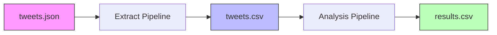
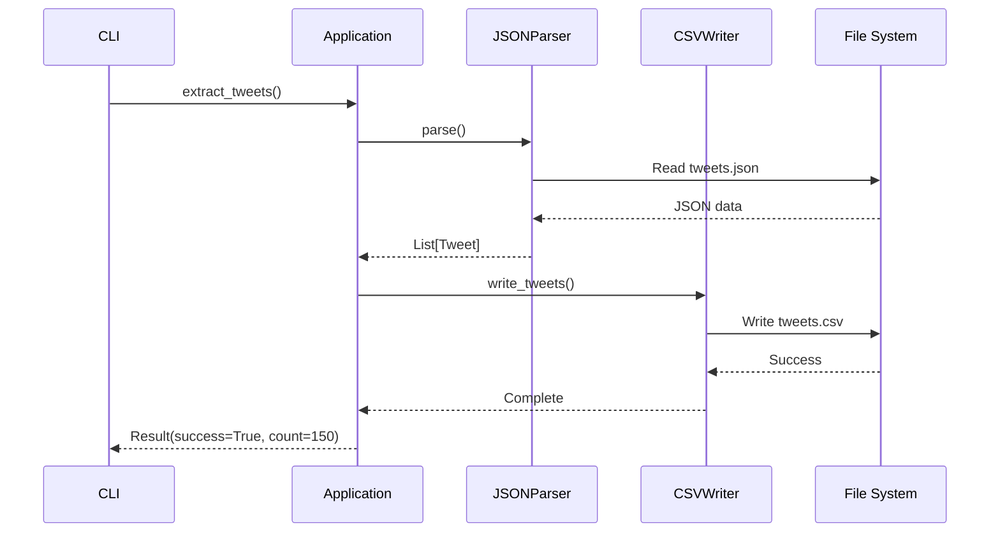
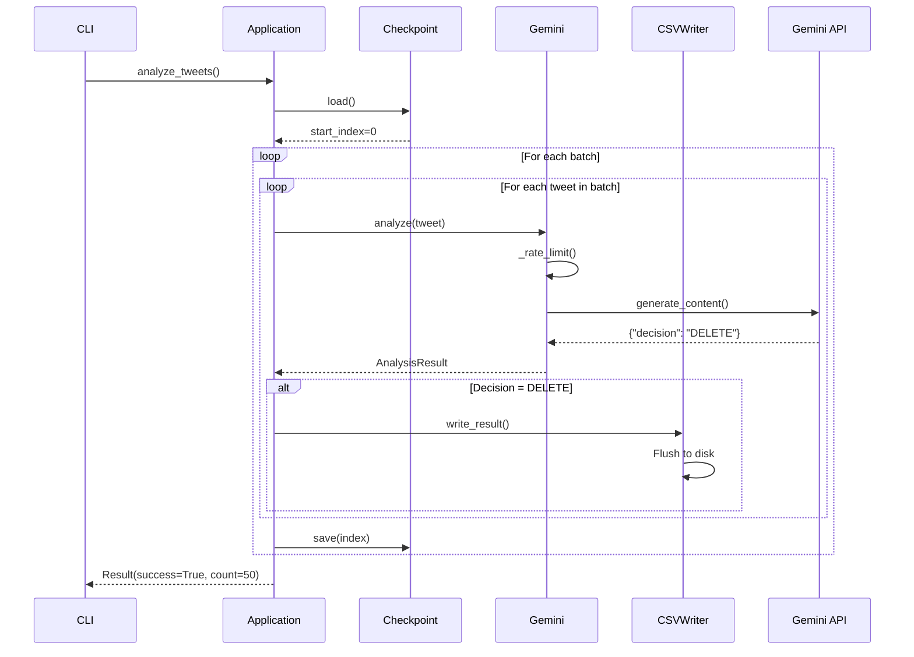
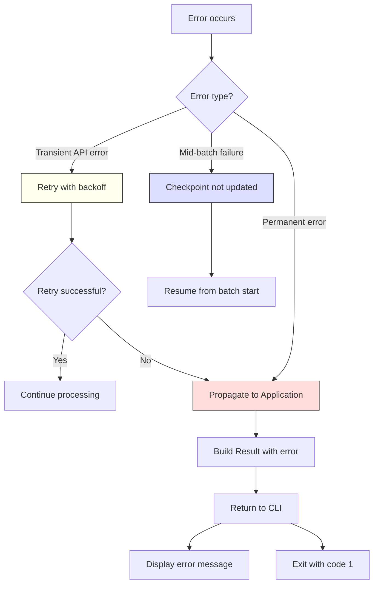

This guide explains how data flows through the system, from raw Twitter archive to actionable deletion candidates.

## Overview

The tool processes data in two distinct pipelines:



## Extract pipeline

Transforms Twitter's complex JSON archive into a simplified CSV format.

### Input: Twitter archive JSON

**Location:** `data/tweets/tweets.json`

**Format:**
```json tweets.json
[
  {
    "tweet": {
      "id_str": "1234567890",
      "full_text": "This is my tweet content",
      "created_at": "2023-01-15T10:30:00Z",
      "retweet_count": 5,
      "favorite_count": 12
      // ... many other fields
    }
  },
  {
    "tweet": {
      "id_str": "9876543210",
      "full_text": "Another tweet here"
      // ...
    }
  }
]
```

<Note>
Twitter archives contain 50+ fields per tweet. We only extract what we need: `id_str` and `full_text`.
</Note>

### Step 1: Parse JSON

**Component:** `JSONParser` (storage.py:35)

```python
parser = JSONParser(settings.tweets_archive_path)
tweets = parser.parse()
```

**Processing:**
1. Load entire JSON file into memory
2. Iterate through array of tweet objects
3. Extract `id_str` and `full_text` from each `tweet` object
4. Create immutable `Tweet` objects

**Output:** `List[Tweet]`
```python
[
    Tweet(id="1234567890", content="This is my tweet content"),
    Tweet(id="9876543210", content="Another tweet here"),
    # ...
]
```

### Step 2: Write to CSV

**Component:** `CSVWriter` (storage.py:131)

```python
with CSVWriter(settings.transformed_tweets_path) as writer:
    writer.write_tweets(tweets)
```

**Processing:**
1. Create output directory if needed
2. Open CSV file for writing
3. Write header row: `id,text`
4. Write one row per tweet
5. Close file (automatic via context manager)

### Output: Transformed CSV

**Location:** `data/tweets/transformed/tweets.csv`

**Format:**
```csv tweets.csv
id,text
1234567890,"This is my tweet content"
9876543210,"Another tweet here"
```

<Info>
**Why this transformation?**
- Simpler format (2 columns vs 50+ fields)
- Human-readable (can inspect in Excel)
- Faster to parse for analysis
- Smaller file size
</Info>

### Visual flow



## Analysis pipeline

Processes tweets through Gemini AI and identifies deletion candidates.

### Input: Transformed CSV

**Location:** `data/tweets/transformed/tweets.csv`

Same format as extract pipeline output.

### Step 1: Load tweets and checkpoint

**Component:** `CSVParser` + `Checkpoint` (storage.py:61, storage.py:84)

```python
parser = CSVParser(settings.transformed_tweets_path)
tweets = parser.parse()

with Checkpoint(settings.checkpoint_path) as checkpoint:
    start_index = checkpoint.load()
```

**Processing:**
1. Parse entire CSV into `List[Tweet]`
2. Load checkpoint (0 if first run, or saved index)
3. Skip already-processed tweets

**Example:**
```python
# First run
start_index = 0  # Process from beginning

# After interruption at tweet 100
start_index = 100  # Resume from tweet 100
```

### Step 2: Batch processing loop

**Component:** `Application.analyze_tweets()` (application.py:64)

```python
for i in range(start_index, len(tweets), settings.batch_size):
    batch = tweets[i:i+settings.batch_size]
    
    for tweet in batch:
        # Process tweet
    
    checkpoint.save(i + len(batch))
```

**Batching behavior:**

<Tabs>
  <Tab title="Batch 1">
    **Tweets 0-9** (batch_size=10)
    
    ```python
    batch = tweets[0:10]
    # Process 10 tweets
    checkpoint.save(10)
    ```
  </Tab>
  <Tab title="Batch 2">
    **Tweets 10-19**
    
    ```python
    batch = tweets[10:20]
    # Process 10 tweets
    checkpoint.save(20)
    ```
  </Tab>
  <Tab title="Interruption">
    **At tweet 23**
    
    ```python
    batch = tweets[20:30]
    # Processed tweets 20, 21, 22
    # User presses Ctrl+C at tweet 23
    # Checkpoint still at 20 (batch not complete)
    ```
  </Tab>
  <Tab title="Resume">
    **Restart from tweet 20**
    
    ```python
    start_index = checkpoint.load()  # Returns 20
    batch = tweets[20:30]
    # Re-process tweets 20-29
    ```
  </Tab>
</Tabs>

<Warning>
**Important:** Checkpoint updates only after full batch completes. If interrupted mid-batch, those tweets will be re-processed on resume.
</Warning>

### Step 3: Filter retweets

**Component:** `_is_retweet()` (application.py:125)

```python
for tweet in batch:
    if _is_retweet(tweet):
        continue  # Skip retweets
    
    result = self.analyzer.analyze(tweet)
```

**Retweet detection:**
```python
def _is_retweet(tweet) -> bool:
    return tweet.content.startswith("RT @")
```

**Examples:**
```python
# Retweet (skipped)
Tweet(id="123", content="RT @someone: Great point!")

# Original tweet (analyzed)
Tweet(id="456", content="Here's my original thought")
```

### Step 4: AI analysis

**Component:** `Gemini.analyze()` (analyzer.py:71)

```python
result = self.analyzer.analyze(tweet)
```

**Processing:**

<Steps>
  <Step title="Rate limiting">
    Enforce minimum delay since last request (default: 1 second)
    
    ```python
    elapsed = time.time() - self.last_request_time
    if elapsed < 1.0:
        time.sleep(1.0 - elapsed)
    ```
  </Step>
  <Step title="Build prompt">
    Construct prompt with tweet content and criteria
    
    ```python
    prompt = self._build_prompt(tweet)
    ```
  </Step>
  <Step title="Call Gemini API">
    Send prompt to Gemini with JSON response format
    
    ```python
    response = self.client.models.generate_content(
        model=self.model,
        contents=prompt,
        config={"response_mime_type": "application/json"}
    )
    ```
  </Step>
  <Step title="Parse response">
    Extract decision from JSON response
    
    ```python
    data = json.loads(response.text)
    decision = Decision(data["decision"].upper())
    ```
  </Step>
  <Step title="Create result">
    Return AnalysisResult with tweet URL and decision
    
    ```python
    return AnalysisResult(
        tweet_url=settings.tweet_url(tweet.id),
        decision=decision
    )
    ```
  </Step>
</Steps>

**API Request:**
```json
{
  "model": "gemini-2.5-flash",
  "contents": "You are evaluating tweets...\n\nTweet: 'This is problematic content'...",
  "config": {
    "response_mime_type": "application/json"
  }
}
```

**API Response:**
```json
{
  "decision": "DELETE",
  "reason": "Contains unprofessional language"
}
```

**Converted to:**
```python
AnalysisResult(
    tweet_url="https://x.com/username/status/1234567890",
    decision=Decision.DELETE
)
```

### Step 5: Write results

**Component:** `CSVWriter.write_result()` (storage.py:172)

```python
if result.decision == Decision.DELETE:
    writer.write_result(result)
```

<Info>
**Only DELETE decisions are written to results.** KEEP decisions are silently skipped. This keeps the output focused on actionable items.
</Info>

**Processing:**
1. Check if decision is DELETE
2. If yes, write row to results CSV
3. Flush to disk immediately (ensures no data loss)
4. If no, skip (don't write KEEP decisions)

### Step 6: Update checkpoint

**Component:** `Checkpoint.save()` (storage.py:121)

```python
checkpoint.save(i + len(batch))
```

**Processing:**
1. Seek to beginning of checkpoint file
2. Truncate (clear existing content)
3. Write new index
4. Flush to disk

**Checkpoint file:**
```
30
```

Simple integer representing next tweet index to process.

### Output: Results CSV

**Location:** `data/tweets/processed/results.csv`

**Format:**
```csv results.csv
tweet_url,deleted
https://x.com/username/status/1234567890,false
https://x.com/username/status/9876543210,false
```

**Fields:**
- `tweet_url`: Direct link to tweet (clickable in spreadsheets)
- `deleted`: Manual tracking column (initialized to `false`)

<Accordion title="Why include 'deleted' column?">
Allows users to manually track deletion progress:

1. Open results.csv in Excel/Google Sheets
2. Click tweet URL to review
3. Delete tweet on Twitter
4. Mark `deleted` as `true` in spreadsheet
5. Track completion progress
</Accordion>

### Visual flow



## Data transformations

Summary of how data structure changes through the pipeline:

<Tabs>
  <Tab title="Twitter JSON">
    **Input format from Twitter**
    
    ```json
    {
      "tweet": {
        "id_str": "1234567890",
        "full_text": "Tweet content",
        "created_at": "...",
        "retweet_count": 5,
        // 50+ other fields
      }
    }
    ```
    
    **Size:** ~5-10 KB per tweet (large)
  </Tab>
  <Tab title="Python objects">
    **Internal representation**
    
    ```python
    Tweet(
        id="1234567890",
        content="Tweet content"
    )
    ```
    
    **Size:** ~1 KB per tweet (minimal)
  </Tab>
  <Tab title="Transformed CSV">
    **Intermediate format**
    
    ```csv
    id,text
    1234567890,"Tweet content"
    ```
    
    **Size:** ~0.5 KB per tweet (efficient)
  </Tab>
  <Tab title="Results CSV">
    **Output format**
    
    ```csv
    tweet_url,deleted
    https://x.com/user/status/1234567890,false
    ```
    
    **Size:** Only flagged tweets (typically 5-10% of total)
  </Tab>
</Tabs>

## Error handling flow

How errors propagate through the system:



**Examples:**

<CodeGroup>
```python Transient error (retried)
try:
    result = gemini.analyze(tweet)
except RateLimitError:
    # Retry 3 times with backoff
    # If still fails, propagate
```

```python Permanent error (immediate fail)
try:
    tweets = parser.parse()
except FileNotFoundError as e:
    return Result(
        success=False,
        error_type="file_not_found",
        error_message=str(e)
    )
```

```python Mid-batch failure (checkpoint preserved)
for i in range(start_index, len(tweets), batch_size):
    batch = tweets[i:i+batch_size]
    
    for tweet in batch:
        result = analyzer.analyze(tweet)  # Fails on tweet 3
        # Checkpoint still at batch start
        # On restart, re-process from batch start
```
</CodeGroup>

## Performance characteristics

### Time analysis

For 5,000 tweets with default settings:

<Steps>
  <Step title="Extract">
    **~1-2 seconds**
    
    - Parse JSON: O(n)
    - Write CSV: O(n)
    - Memory-bound operation
  </Step>
  <Step title="Analysis">
    **~1.5-2 hours**
    
    - 5,000 tweets × 1 req/sec = 5,000 seconds
    - Plus API latency (~500ms per request)
    - Network-bound operation
  </Step>
</Steps>

### Memory usage

<Accordion title="Extract phase">
**Memory:** O(n) where n = number of tweets

```python
tweets = parser.parse()  # All tweets in memory
writer.write_tweets(tweets)  # Still in memory
```

For 50,000 tweets × 200 bytes = ~10 MB
</Accordion>

<Accordion title="Analysis phase">
**Memory:** O(batch_size)

```python
for i in range(start_index, len(tweets), batch_size):
    batch = tweets[i:i+batch_size]  # Only 10 tweets in memory
```

For batch_size=10 × 200 bytes = ~2 KB
</Accordion>

## Next steps

<CardGroup cols={2}>
  <Card title="Component details" icon="cubes" href="/architecture/components">
    Deep dive into each module's implementation
  </Card>
  <Card title="Design decisions" icon="lightbulb" href="/architecture/design-decisions">
    Understand why the system works this way
  </Card>
</CardGroup>